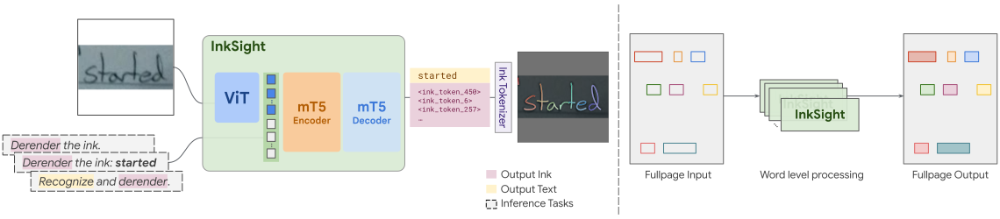
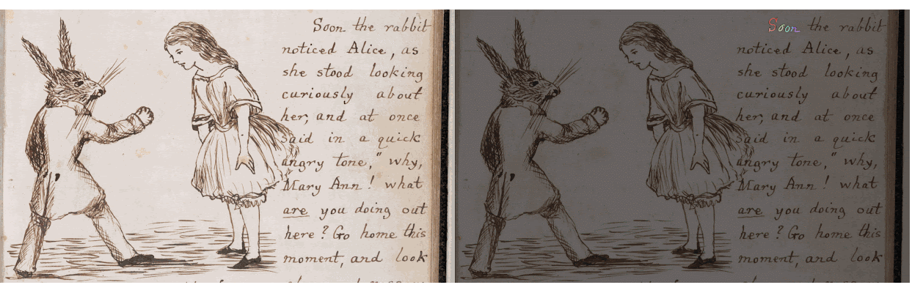

 

# InkSight: Offline-to-Online Handwriting Conversion by Learning to Read and Write

<p align="center" style="font-size: 16px;">
    <a href="https://scholar.google.com/citations?user=L6rrZxAAAAAJ&hl=en"><strong>Blagoj Mitrevski&dagger;</strong></a> &bull; 
    <a href="https://github.com/arinaruck"><strong>Arina Rak&dagger;</strong></a> &bull; 
    <a href="https://scholar.google.com/citations?user=P02RNa8AAAAJ&hl=en"><strong>Julian Schnitzler&dagger;</strong></a> &bull; 
    <a href="https://scholar.google.com/citations?user=yTNl4IYAAAAJ&hl=en"><strong>Chengkun Li&dagger;</strong></a> &bull; 
    <a href="https://scholar.google.com/citations?user=QZd-fvAAAAAJ&hl=en"><strong>Andrii Maksai&ddagger;</strong></a> &bull; 
    <a href="https://scholar.google.com/citations?hl=en&user=CSHNLDcAAAAJ&view_op=list_works&sortby=pubdate"><strong>Jesse Berent</strong></a> &bull; 
    <a href="https://scholar.google.com/citations?user=n4bdAtIAAAAJ&hl=en"><strong>Claudiu Musat</strong></a>
</p>

<p align="center" style="font-size: 14px; color: #555;">
    <sup>&dagger;</sup> Joint first authors &nbsp;&nbsp;|&nbsp;&nbsp; <sup>&ddagger;</sup> Corresponding author
</p>

<p align="center">
  <a href="https://arxiv.org/abs/2402.05804">
    
  </a> 
  <a href="https://huggingface.co/spaces/Derendering/Model-Output-Playground">
    
  </a> 
  <a href="https://research.google/blog/a-return-to-hand-written-notes-by-learning-to-read-write/">
    
  </a>
  <a href="https://charlieleee.github.io/publication/inksight/">
    
  </a>
</p>

<div>
<p align="center">
  
</p>

<p align="center">
  
</p>

</div>

---

## News

- **October 2024**: Our work is now featured on the **[Google Research Blog](https://research.google/blog/a-return-to-hand-written-notes-by-learning-to-read-write/)**! 

- **February 2024**: The **[InkSight Demo on Hugging Face](https://huggingface.co/spaces/Derendering/Model-Output-Playground)** is live!


---


## Run Gradio 🤗 Playground Locally

To set up and run the Gradio <a href='https://github.com/gradio-app/gradio'></a> Playground locally, you can use the following steps:
```bash
# Clone the huggingface space
git clone https://huggingface.co/spaces/Derendering/Model-Output-Playground

# Install the dependencies (skip if you have them already)
pip install gradio gdown
```

Then inside the cloned directory, you can run the following command to interact with the playground:
```bash
# Run the Gradio Playground
python app.py
```

---

## Releases
We provide open resources for InkSight public version model. Choose the options that best fit your needs:

- [Public version model for CPU/GPU inference](https://storage.googleapis.com/derendering_model/small-p-cpu.zip) (494 MB)
- [Public version model for TPU inference](https://storage.googleapis.com/derendering_model/small-p-tpu.zip) (494 MB)
- [Supplementary material for the paper](https://storage.googleapis.com/derendering_model/derendering_supp.zip). This is used in the example colab linked below, which automatically downloads this content.
- [Example code](colab.ipynb) in the form of a Colab notebook that showcases model inference results on several samples and example code to run the inference. <a href="https://githubtocolab.com/google-research/inksight/blob/main/colab.ipynb" target="_blank"></a>
- [Samples of model outputs](figures/) of huggingface demo.

---

## Licenses
 
The code in this repository is released under the [Apache 2 license](https://github.com/google-research/google-research/blob/master/LICENSE).

---

## Disclaimer

*Please note: This is not an officially supported Google product.*

---

## Citation

If you find our work useful for your research and applications, please cite using this BibTeX:

```bibtex
@article{mitrevski2024inksight,
  title={InkSight: Offline-to-Online Handwriting Conversion by Learning to Read and Write},
  author={Mitrevski, Blagoj and Rak, Arina and Schnitzler, Julian and Li, Chengkun and Maksai, Andrii and Berent, Jesse and Musat, Claudiu},
  journal={arXiv preprint arXiv:2402.05804},
  year={2024}
}
```
